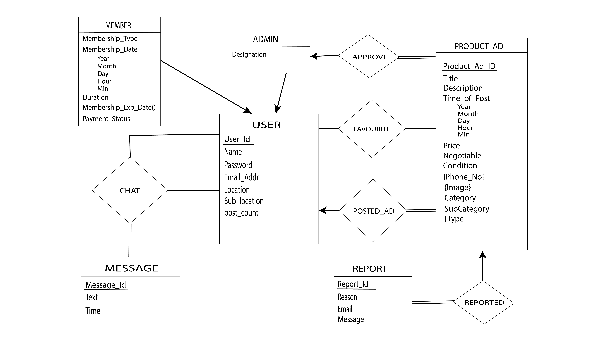

# Bikroy.com
A simple replica of bikroy.com. This is a project for learning purpose. This project is developed using

    > Backend framework: Django
    > Frontend framework: Bootstrap
    > DBMS: Oracle

Demo video https://drive.google.com/file/d/1jDwF7WuPzP5xDzcn5j-mDDsOEceEhtR0/view?usp=sharing

## Database setup
1. Create a database in Oracle
2. Create a user in Oracle
3. create the database by running the ddl code in `database_creation_essentials\ddl.txt` file

## ERD
